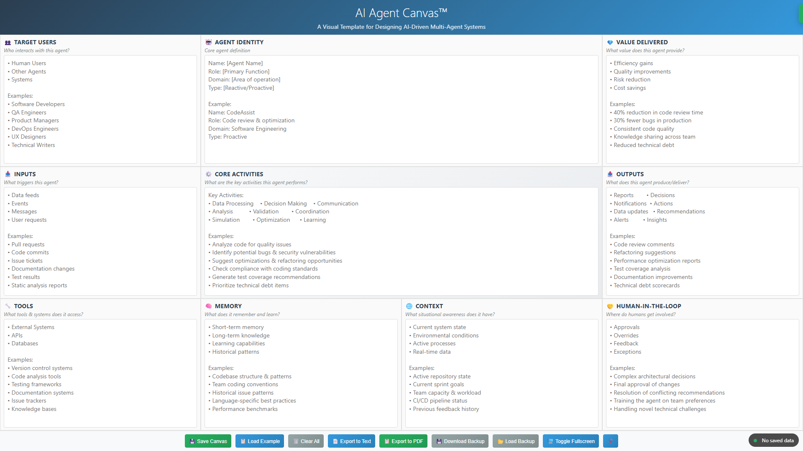

# AI Agent Canvas™ User Guide

## Overview

The AI Agent Canvas™ is a visual template for designing AI-driven multi-agent systems. It provides a structured framework to help you define and document your AI agent's characteristics, behaviors, and interactions.

The canvas provides a comprehensive framework for designing intelligent agents, helping you visualize all critical components and their relationships.

## Getting Started

### Installation

This is a standalone web application that runs in any modern browser. To use the AI Agent Canvas:

1. Extract all files from the zip archive to a folder on your computer
2. Make sure to keep all files in the same directory (the HTML file and the jsPDF library)
3. Open the `ai-agent-canvas.html` file in your web browser (Chrome, Firefox, Edge, or Safari)

### System Requirements

- A modern web browser (Chrome, Firefox, Edge, or Safari - latest versions recommended)
- JavaScript enabled
- Local file access permissions for your browser
- No internet connection required (the app works completely offline)

## Using the Canvas

### Canvas Sections

The canvas is divided into 10 key sections, each focusing on a different aspect of your AI agent:

1. **TARGET USERS**: Define who will interact with your agent (human users, other agents, systems)
2. **AGENT IDENTITY**: Establish the core definition of your agent (name, role, domain, type)
3. **VALUE DELIVERED**: Articulate the value and benefits your agent provides
4. **INPUTS**: Document what triggers or activates your agent
5. **CORE ACTIVITIES**: Detail the key functions and processes your agent performs
6. **OUTPUTS**: Specify what your agent produces or delivers
7. **TOOLS**: List the tools, systems, and resources your agent utilizes
8. **MEMORY**: Define what your agent remembers and learns over time
9. **CONTEXT**: Describe the situational awareness your agent maintains
10. **HUMAN-IN-THE-LOOP**: Identify where human intervention is required or beneficial

### Basic Controls

At the bottom of the canvas, you'll find several control buttons:

- **💾 Save Canvas**: Saves your current work to your browser's local storage
- **📋 Load Example**: Loads a pre-filled example to help you get started
- **🗑️ Clear All**: Erases all content from all sections
- **📄 Export to Text**: Exports your canvas to a plain text file
- **📋 Export to PDF**: Exports your canvas to a professionally formatted PDF
- **💾 Download Backup**: Saves your work as a JSON file on your computer
- **📂 Load Backup**: Restores your work from a previously saved JSON file
- **🖥️ Toggle Fullscreen**: Switches between fullscreen and windowed mode

## Working with the Canvas

### Auto-Save Feature

The canvas automatically saves your work to your browser's local storage as you type. A status indicator in the bottom-right corner shows when changes are saved.

### Creating Your First Canvas

1. Click **📋 Load Example** to see how a completed canvas looks
2. Click **🗑️ Clear All** to start with a blank canvas
3. Fill in each section with details about your AI agent
4. Your work is automatically saved as you type

### Best Practices

- Use bullet points for clarity (• can be typed with Alt+7 on the numeric keypad)
- Fill in all sections for a complete agent definition
- Be specific about your agent's capabilities and limitations
- Consider the interconnections between different sections
- Use the example as a reference for formatting and level of detail

### Exporting Your Work

- **Text Export**: Creates a plain text file with all your canvas content
- **PDF Export**: Generates a visually formatted PDF document with your canvas layout preserved
- **Backup**: Creates a JSON file that can be used to restore your work on any computer

## Troubleshooting

### Common Issues

- **Save Failed**: If you see a "Save Failed" message, your browser's local storage may be full. Use the "Download Backup" option to save your work.
- **PDF Export Fails**: Some browsers have limitations with PDF generation. Try the text export instead.
- **Display Issues**: For the best experience, use the fullscreen mode or try a different browser.

### Data Recovery

The application creates automatic backups in your browser's local storage. If you accidentally clear your canvas, check if there's a backup by:

1. Closing and reopening the application
2. If your data doesn't reappear, there may not be a recoverable backup

Always use the "Download Backup" option periodically to save important work to your computer.

## Privacy Notice

This application works entirely in your browser and does not send any data to external servers. All your work is stored locally on your device, ensuring complete privacy and data security.

## License and Copyright

AI Agent Canvas™ is provided for personal and professional use. All rights reserved.

---

For questions or support, please open an issue on the GitHub repository.
